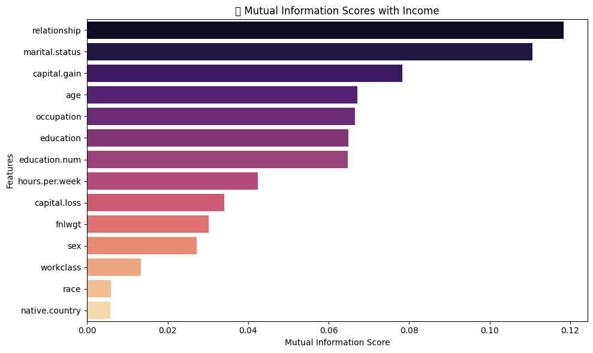

# 📄 IncomeInsight – Project Report - 🟢 **Beginner Track**

Welcome to your personal project report!  
Use this file to answer the key reflection questions for each phase of the project. This report is designed to help you think like a data scientist, guide AI tools more effectively, and prepare for real-world job interviews.

---

## ✅ Week 1: Setup & Exploratory Data Analysis (EDA)

> Answer the EDA questions provided in the project materials here. Focus on data quality, trends, anomalies, and relationships.

### 🔑 Question 1: What features show the strongest correlation with earning >$50K?

### 🔢 Numerical Correlation Analysis

I computed Pearson correlations between numerical features and the binary income label (`<=50K` = 0, `>50K` = 1). The following heatmap summarizes the results:

**Key Observations**:
- `education-num`, `capital-gain`, and `hours-per-week` have the strongest positive correlation with income.
- `fnlwgt` and `capital-loss` have weaker or inconsistent correlations.

### 🧠 Mutual Information (All Features)

I computed mutual information to evaluate how informative each feature is for predicting income. This technique works with both categorical and numerical features.

**Top Predictors**:
- `relationship` and `marital.status` are the most informative features.
- `capital.gain`, `education`, and `occupation` also show strong predictive power.
- `race`, `native-country`, and `fnlwgt` contribute very little.

---

### 🔑 Question 2: How does income vary with education, marital status, or hours worked per week?

### 🎓 Education and Income

- Individuals with **Bachelor’s, Master’s, and Doctorate degrees** are more likely to earn >$50K.
- The vast majority of individuals with **lower education levels (HS-grad and below)** earn ≤$50K.
- Advanced education is correlated with higher earning potential, though such individuals are fewer in the dataset.

### 💍 Marital Status and Income

- Individuals who are **"Married-civ-spouse"** have the **highest proportion** of >$50K earners.
- **"Never-married"** individuals are predominantly in the ≤$50K category, suggesting lower income is common among single people.
- Categories such as **"Divorced"**, **"Separated"**, and **"Widowed"** show very low high-income representation.

### 🕒 Hours Worked per Week and Income

- Both income groups have a **median of 40 hours/week**, as shown in the labels above each box.
- However, individuals earning >$50K display a **much wider range** of work hours.
- Many high-income earners work **significantly more than 40 hours**, suggesting that while 40 is a common standard, putting in extra hours is often associated with higher income.

### 🔑 Question 3: Are there disparities across race, sex, or native country?

### 🌍 Race and Income

- The majority of the dataset consists of White individuals, who also make up most of the high-income earners.
- Other racial groups — such as Black, Asian-Pac-Islander, Amer-Indian-Eskimo, and Other — are underrepresented in the >$50K income bracket.
- There are clear disparities in income distribution across racial categories, with White individuals having the highest likelihood of earning >$50K.

### 🧑‍🤝‍🧑 Sex and Income

- **Men** are significantly more likely to earn >$50K compared to women.
- While both genders have a large presence in the dataset, the proportion of **high-income males** is much greater.
- The **gender income disparity** is clearly visible in this distribution.

### 🌐 Native Country and Income

- The dataset is heavily skewed toward individuals from the **United States**, which dominates both income brackets.
- Non-U.S. countries show **very few individuals earning >$50K**, even in the top 10 most common native countries.
- This may indicate disparities in economic opportunities or representation among immigrants and foreign-born residents.
- For modeling purposes, this imbalance should be considered to avoid bias toward U.S.-centric outcomes.

### 🔑 Question 4: Do capital gains/losses strongly impact the income label?

### 💰 Capital Gains and Income

- Most individuals have little or no capital gains (visible as a high spike near 0).
- A **notable portion of high-income earners** have significant capital gains — evident from the **secondary peak** in the >$50K group between log(1 + gain) 8 to 10.
- This indicates that **capital gains strongly correlate with higher income**, making it a valuable predictive feature.

### 📉 Capital Loss and Income

- The majority of both income groups report **no capital losses**, seen in the peak at log(1) = 0.
- A **small subset of higher-income individuals** shows a secondary peak around log(1+loss) ≈ 8, indicating losses of ~$3,000.
- While this suggests some relationship between **investment-related loss and high income**, the effect is **less pronounced than capital gains**.

## ✅ Week 2: Feature Engineering & Data Preprocessing

### 🔑 Question 1:
**Which features in the dataset appear to have the strongest relationship with the income label (>50K), and how did you determine this?**  

To identify which features most influence income, we calculated **Mutual Information (MI) scores**, a measure that captures the amount of information each feature contributes to predicting the target variable (`income`). This method accommodates both **categorical** and **numerical** features after encoding.

The results are shown below:

| Feature           | MI Score   |
|------------------|------------|
| relationship      | **0.1133** |
| marital.status    | **0.1111** |
| capital.gain      | 0.0822     |
| education.num     | 0.0666     |
| age               | 0.0662     |
| education         | 0.0642     |
| occupation        | 0.0617     |
| hours.per.week    | 0.0408     |
| capital.loss      | 0.0351     |
| sex               | 0.0314     |
| fnlwgt            | 0.0311     |
| workclass         | 0.0147     |
| race              | 0.0081     |
| native.country    | 0.0032     |

**Key Insight:**
- The highest mutual information scores are from `relationship` (0.1133), `marital.status` (0.1111), and `capital.gain` (0.0822), indicating that these features have the most **significant impact** on income prediction.
- Features with low MI scores, such as `race` and `native.country`, contribute relatively little to income prediction.

📊 **Visual Summary:**  

---

### 🔑 Question 2:
**Did you engineer any new features from existing ones? If so, explain the new feature(s) and why you think they might help your classifier.**  

#### 🔧 Engineered Features Analysis (Q2)

To enhance model interpretability, I created the following features:
- `occupation_mean_hours`: Avg. weekly hours per occupation
- `workclass_mean_hours`: Avg. weekly hours per workclass

I evaluated their usefulness via the correlation matrix below:

📊 

**Observations:**
- `occupation_mean_hours` shows a meaningful positive correlation with income (~0.24), suggesting people in time-intensive occupations are more likely to earn >50K.
- `workclass_mean_hours` also shows a modest correlation (~0.14), which may contribute some value but is relatively weaker than `occupation_mean_hours`.

### 🔑 Question 3:
**Which continuous features required scaling or transformation before modeling, and which method did you use?**  

Several features had different value ranges or skewed distributions that required transformation or scaling for effective model training:

#### ✅ Features Scaled Using `StandardScaler`:
I applied standardization (zero mean, unit variance) to the following features that were roughly symmetric:

- `age`
- `education.num`
- `hours.per.week`
- `occupation_mean_hours`
- `workclass_mean_hours`

#### 🔁 Features Transformed Using `log1p(x)`:
These features were highly right-skewed and contained many zero values, so we applied a log transformation before scaling:

- `capital.gain`
- `capital.loss`
- `fnlwgt` (optional but included)

This preprocessing ensures better convergence during training and reduces the impact of outliers or skewed distributions.

I then applied `StandardScaler` on the transformed values to keep all continuous features on a consistent scale.

---

### 🔑 Question 4:
**Is the target variable (`income`) imbalanced? How did you check, and what will you do (if anything) to handle it?**  

**Is the target variable (`income`) imbalanced? How did you check, and what will you do (if anything) to handle it?**

I checked the balance of the `income` target variable by calculating class proportions and plotting a bar chart:

📊 **Income Class Distribution (%):**
- Class `0` (≤50K): **75.1%**  
- Class `1` (>50K): **24.9%**

This indicates a significant class imbalance, where most individuals fall into the ≤50K category.

To address this imbalance, I plan to:
- Use **stratified sampling** when splitting the dataset into training and testing sets  
- Consider models that support **class weighting** (e.g., `class_weight='balanced'`)  
- Optionally try **oversampling techniques** like SMOTE if model performance is impacted

### 🔑 Question 5:
**What does your final cleaned dataset look like before modeling? Include shape, types of features (numerical/categorical), and a summary of the preprocessing steps applied.**  
🎯 *Purpose: Encourages documentation and preparation for modeling.*

💡 **Hint:**  
Use `df.shape`, `df.dtypes`, and summarize what was dropped, encoded, scaled, or engineered.

✏️ *Your answer here...*

---

---

### ✅ Week 3: Model Development & Experimentation

### 🔑 Question 1:
**Which classification models did you train for predicting income, and what are the strengths or assumptions of each model?**  
🎯 *Purpose: Tests understanding of algorithm selection and fit for the problem.*

💡 **Hint:**  
Train Logistic Regression (baseline, interpretable), Random Forest (handles non-linearities), and XGBoost (boosted performance).  
Explain what each model assumes (e.g., linearity in Logistic Regression) or does well (e.g., handling missing values, feature interactions).

✏️ *Your answer here...*

---

### 🔑 Question 2:
**How did each model perform based on your evaluation metrics (accuracy, precision, recall, F1-score, ROC-AUC)? Which performed best, and why?**  
🎯 *Purpose: Tests ability to evaluate and compare classifiers fairly.*

💡 **Hint:**  
Use `classification_report`, `confusion_matrix`, and `roc_auc_score`.  
Show results in a table or chart.  
Explain model strengths (e.g., better recall = catches more high-income earners).

✏️ *Your answer here...*

---

### 🔑 Question 3:
**Is your model biased toward one class (>$50K or ≤$50K)? How did you detect this, and what might you do to fix it?**  
🎯 *Purpose: Tests understanding of class imbalance and metric interpretation.*

💡 **Hint:**  
Inspect confusion matrix, precision/recall per class.  
Use `.value_counts()` on the `income` label to see imbalance.  
Consider using `class_weight='balanced'` or resampling techniques.

✏️ *Your answer here...*

---

### 🔑 Question 4:
**What features were most important in your best-performing model, and do they align with expectations about income prediction?**  
🎯 *Purpose: Tests interpretability and domain reasoning.*

💡 **Hint:**  
Use `.feature_importances_` for tree models or `.coef_` for Logistic Regression.  
Do features like `education`, `occupation`, or `hours_per_week` appear at the top?  
Visualize using bar plots.

✏️ *Your answer here...*

---

### 🔑 Question 5:
**How did you use MLflow to track your model experiments, and what comparisons did it help you make?**  
🎯 *Purpose: Tests reproducibility and experiment tracking skills.*

💡 **Hint:**  
Log model name, hyperparameters, evaluation metrics, and notes.  
Use MLflow’s comparison view to track which run performed best.  
Share screenshots or describe insights gained.

✏️ *Your answer here...*

---

## ✅ Week 4: Model Selection & Hyperparameter Tuning

### 🔑 Question 1:
**Which hyperparameters did you tune for your best-performing model, and how did you decide which ones to adjust?**

💡 **Hint:**
For Logistic Regression: C, solver.
For Random Forest: n_estimators, max_depth, min_samples_split.
For XGBoost: learning_rate, max_depth, n_estimators.

✏️ Your answer here...

---

### 🔑 Question 2:
**What method did you use for hyperparameter tuning (e.g., GridSearchCV, RandomizedSearchCV), and why?**

💡 **Hint:**
GridSearch = exhaustive but slow.
RandomizedSearch = faster, good for large search spaces.

✏️  *Your answer here...*

---

### 🔑 Question 3:
**How did the tuned model’s performance compare to the baseline version, and what does that tell you about the value of tuning?**

💡 **Hint:**
Compare metrics (accuracy, F1, AUC) from Week 3 and Week 4 side-by-side.
Small improvements may still matter in real-world deployment.

✏️  *Your answer here...*

---

### 🔑 Question 4:
**What risk of overfitting did you observe during tuning, and how did you mitigate it?**

💡 **Hint:**
Use cross-validation and monitor gap between train/test metrics.
Apply early stopping (XGBoost), pruning (trees), or reduce model complexity.

✏️  *Your answer here...*

---

### 🔑 Question 5:

**Which model and hyperparameters did you ultimately select for deployment, and why?**

💡 **Hint:**
Explain the tradeoff between interpretability, performance, and generalization.
Justify final parameter choices and their business relevance.

✏️  *Your answer here...*

---

## ✅ Week 5: Model Deployment

> Document your approach to building and deploying the Streamlit app, including design decisions, deployment steps, and challenges.

### 🔑 Question 1:

### 🔑 Question 2:

### 🔑 Question 3:

### 🔑 Question 4:

### 🔑 Question 5:

---

## ✨ Final Reflections

> What did you learn from this project? What would you do differently next time? What did AI tools help you with the most?

✏️ *Your final thoughts here...*

---
